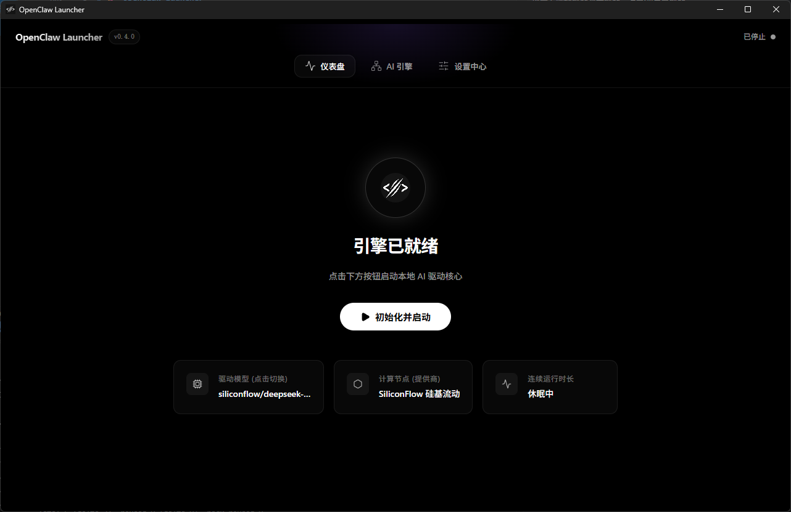
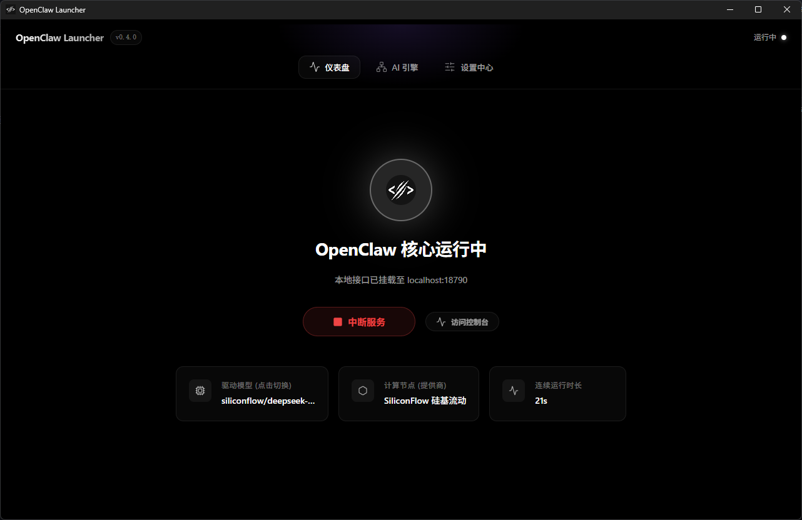
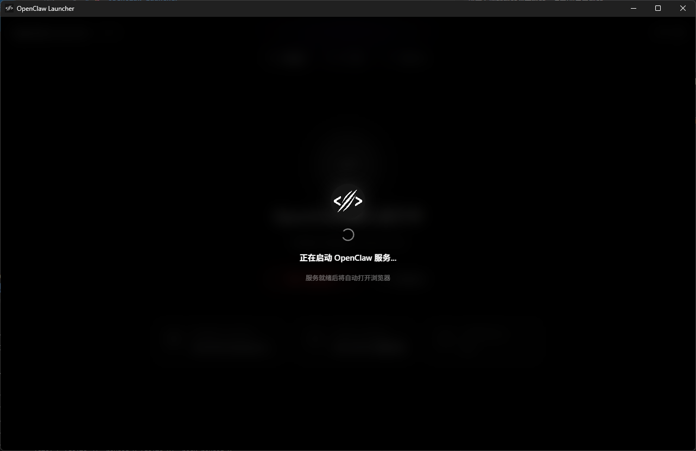
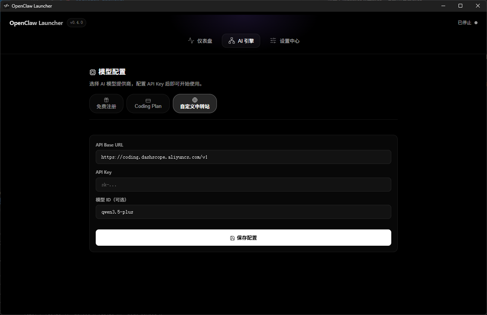
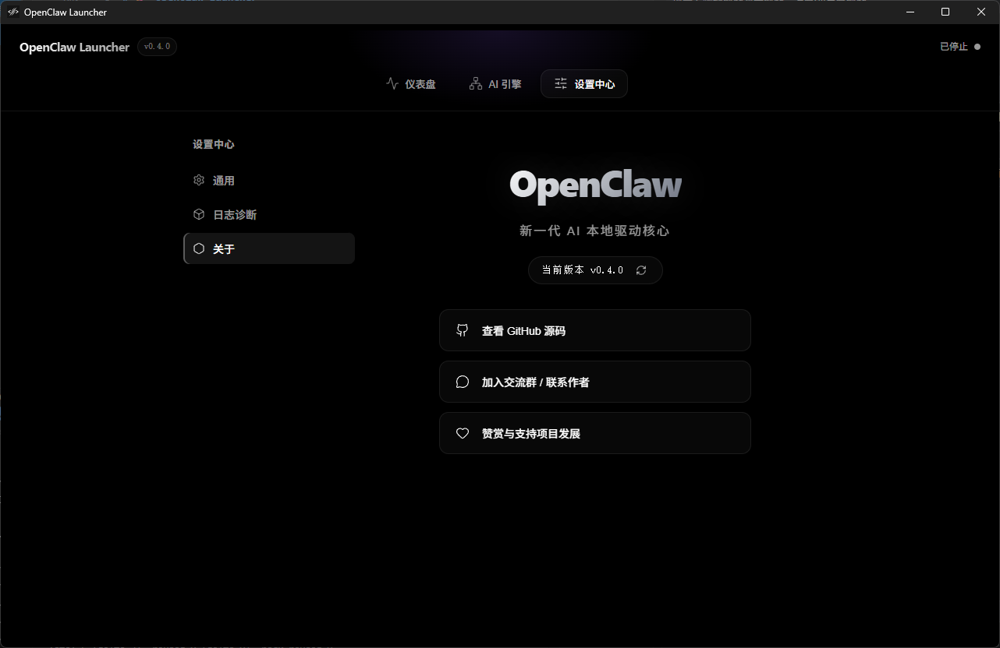

<div align="center">

# 🚀 OpenClaw Launcher

**One-click install, zero config — let anyone run AI coding assistant locally.**

[](https://github.com/ZsTs119/openclaw-launcher/releases)
[](https://github.com/ZsTs119/openclaw-launcher/actions)
[](LICENSE)
[]()

[Download](https://github.com/ZsTs119/openclaw-launcher/releases) · [Features](#-features) · [Quick Start](#-quick-start) · [Development](#-development) · [Contributing](#-contributing)

[🇨🇳 中文](README.md) | **English**

---

*OpenClaw Launcher lets anyone — even with zero programming experience — install and run the [OpenClaw](https://github.com/openclaw/openclaw) AI coding assistant on their own computer. No Node.js setup, no CLI, no config files.*

</div>

## 📸 Screenshots

<div align="center">
<table>
<tr>
<td align="center"><strong>Dashboard — Ready</strong></td>
<td align="center"><strong>Dashboard — Running</strong></td>
</tr>
<tr>
<td></td>
<td></td>
</tr>
<tr>
<td align="center"><strong>Startup Overlay</strong></td>
<td align="center"><strong>AI Engine Config</strong></td>
</tr>
<tr>
<td></td>
<td></td>
</tr>
<tr>
<td align="center" colspan="2"><strong>Settings — About</strong></td>
</tr>
<tr>
<td align="center" colspan="2"></td>
</tr>
</table>
</div>

## ❓ Why a Launcher?

OpenClaw is a powerful AI coding framework, but for non-technical users, installing Node.js, setting environment variables, and running CLI commands is a huge barrier.

**OpenClaw Launcher removes all friction:**

| Before | After |
|---|---|
| Install Node.js → Configure PATH → Download source → npm install → Edit config → Start service | **Double-click Launcher → Click Start → Begin chatting** |

## ✨ Features

### 🎯 Core

- **🔧 Zero Environment Setup** — Auto-downloads portable Node.js, sandboxed in AppData
- **📦 One-Click Source Fetch** — Pulls latest OpenClaw from GitHub, auto-fallback to mirrors
- **📥 Smart Dependency Install** — Runs `npm install` with auto mirror switching
- **▶️ One-Click Start/Stop** — Desktop-grade controls, no terminal needed
- **🌐 Auto Browser Launch** — Opens web UI automatically when service is ready

### 🤖 AI Model Management

- **Multi-Provider** — Built-in support for Groq, SiliconFlow, OpenRouter, DeepSeek, OpenAI, and more
- **Free Models** — Recommended free-tier providers for zero-cost experience
- **Custom Relay Station** — Any OpenAI-compatible API (Base URL + Key)
- **Custom Model ID** — Manually enter any model ID for newly released models
- **One-Click Model Switch** — Switch default model without reconfiguration

### 🎨 Premium UI

- **Dark Theme** — Pure black background + frosted glass + gradient animations
- **Dashboard** — Brand logo with pulse glow + service status + uptime
- **Aurora Startup Screen** — Purple/cyan aurora drift + glowing progress bar
- **Startup Overlay** — Frosted glass overlay during service boot, auto-dismisses

### 🌐 Network Resilience (Optimized for China)

| Resource | Primary | Fallback |
|---|---|---|
| Node.js | `nodejs.org` | `npmmirror.com` |
| OpenClaw Source | `github.com` | `ghfast.top` / `ghproxy.com` |
| NPM Packages | `registry.npmjs.org` | `registry.npmmirror.com` |

All switching is **fully automatic** — 3-second timeout triggers fallback.

### 🛡️ Security

- **No UAC Prompts** — All operations within user AppData directory
- **No Antivirus Alerts** — Pure Rust native APIs, no `.bat` / `.ps1` scripts
- **Sandboxed** — Portable Node.js fully isolated from system environment

## 🖥️ Supported Platforms

| Platform | Architecture | Package Format |
|---|---|---|
| **Windows** | x64 | `.exe` / `.msi` |
| **macOS** | Apple Silicon (M1/M2/M3/M4) | `.dmg` |
| **macOS** | Intel | `.dmg` |
| **Linux** | x64 | `.deb` / `.AppImage` |

## 🚀 Quick Start

### End Users

1. Download the installer from [Releases](https://github.com/ZsTs119/openclaw-launcher/releases)
2. Install and launch OpenClaw Launcher
3. First launch auto-initializes the environment (~2-5 minutes)
4. Select an AI provider and configure your API Key
5. Click "Initialize & Start" → browser opens automatically

### Developers

```bash
# Clone the repo
git clone https://github.com/ZsTs119/openclaw-launcher.git
cd openclaw-launcher

# Install dependencies
npm install

# Development mode (hot reload)
npm run tauri dev

# Production build
npm run tauri build
```

#### Prerequisites

- [Node.js](https://nodejs.org/) ≥ 22
- [Rust](https://www.rust-lang.org/tools/install) ≥ 1.70
- **Linux:** `libwebkit2gtk-4.1-dev libayatana-appindicator3-dev librsvg2-dev`

## 🏗️ Architecture

```
┌──────────────────────────────────────────────────┐
│           OpenClaw Launcher (Tauri v2)            │
├───────────────────┬──────────────────────────────┤
│  React Frontend   │     Rust Backend              │
│                   │                               │
│  ┌─────────────┐  │  ┌──────────────────────┐     │
│  │ SetupWizard │  │  │  environment.rs       │     │
│  │ Dashboard   │  │  │  ├ Node.js download   │     │
│  │ ModelsTab   │  │  │  ├ Sandbox mgmt      │     │
│  │ SettingsTab │  │  │  └ Mirror fallback   │     │
│  └─────────────┘  │  ├──────────────────────┤     │
│                   │  │  setup.rs             │     │
│  Hooks:           │  │  ├ Source download    │     │
│  ├ useSetup      │  │  ├ ZIP extraction     │     │
│  ├ useService    │  │  └ npm install        │     │
│  ├ useConfig     │  │  ├──────────────────────┤     │
│  └ useLogs       │  │  service.rs            │     │
│                   │  │  ├ Process lifecycle  │     │
│  Components:      │  │  ├ Port auto-scan     │     │
│  ├ Header        │  │  └ Log streaming      │     │
│  ├ ApiKeyModal   │  │  ├──────────────────────┤     │
│  ├ ModelSwitch   │  │  config.rs             │     │
│  └ StartupOverlay│  │  ├ API Key mgmt       │     │
│                   │  │  └ Model switching    │     │
│                   │  └──────────────────────┘     │
├───────────────────┴──────────────────────────────┤
│  AppData Sandbox (User-level, no admin)           │
│  ├── node/          (Portable Node.js)            │
│  └── openclaw-engine/ (Source + modules)          │
└──────────────────────────────────────────────────┘
```

## 📂 Project Structure

```
openclaw-launcher/
├── src/                        # React Frontend
│   ├── App.tsx                 # Main app (~180 lines, orchestration only)
│   ├── components/             # UI Components
│   │   ├── Header.tsx          # Top bar (Logo + Version + Status)
│   │   ├── DashboardTab.tsx    # Dashboard (Start/Stop + Status ring)
│   │   ├── ModelsTab.tsx       # Model config page
│   │   ├── SettingsTab.tsx     # Settings (General / Logs / About)
│   │   ├── SetupWizard.tsx     # First-time install wizard
│   │   ├── ApiKeyModal.tsx     # API Key config modal
│   │   ├── ModelSwitchModal.tsx # Model switch modal
│   │   └── StartupOverlay.tsx  # Startup loading overlay
│   ├── hooks/                  # Custom Hooks
│   │   ├── useSetup.ts         # Install flow state management
│   │   ├── useService.ts       # Service start/stop + heartbeat
│   │   ├── useConfig.ts        # API Key / model config
│   │   └── useLogs.ts          # Log management
│   ├── styles/                 # CSS Modules
│   │   ├── global.css          # Design tokens + CSS variables
│   │   ├── dashboard.css       # Dashboard styles
│   │   ├── models.css          # Models page styles
│   │   └── ...                 # Other modular styles
│   └── types/index.ts          # TypeScript type definitions
├── src-tauri/
│   ├── src/
│   │   ├── lib.rs              # Tauri command registration
│   │   ├── environment.rs      # Node.js sandbox management
│   │   ├── setup.rs            # Source download & npm install
│   │   ├── service.rs          # Process lifecycle & logging
│   │   ├── config.rs           # API Key & model config
│   │   ├── providers.rs        # Provider data loading
│   │   └── diagnostics.rs      # Diagnostic log export
│   ├── resources/providers.json # Provider/model definitions
│   ├── Cargo.toml              # Rust dependencies
│   └── tauri.conf.json         # Tauri config
├── docs/
│   ├── PRD.md                  # Product Requirements Document
│   ├── TODO.md                 # Development progress tracking
│   └── phases/                 # Phased technical specs (20 stages)
└── .github/workflows/
    └── build.yml               # CI/CD auto-build + Release
```

## 🗺️ Roadmap

- [x] **Phase 1: MVP Installer** ✅
  - Portable Node.js download & sandbox
  - Source ZIP fetch (smart mirror switching)
  - Sandboxed npm install
- [x] **Phase 2: UX Polish** ✅
  - Config injection + workspace wizard
  - Auto browser launch + human-readable logs
- [x] **Phase 3: API Key Config + UI Rewrite** ✅
  - Multi-provider API Key configuration
  - Tab navigation + dark premium theme
- [x] **Phase 4: Architecture Refactor** ✅
  - Component extraction (11 stages)
  - Custom Hooks + CSS modularization
- [x] **Phase 5: UI Polish + Features** ✅
  - Color system unification + icon consistency
  - Aurora startup screen + dashboard glow effects
  - Custom model ID input
- [ ] **Phase 6: Enterprise Distribution** (planned)
  - Windows code signing
  - macOS notarization
  - In-app auto-update

## 🤝 Contributing

Contributions welcome! Please follow [Conventional Commits](https://www.conventionalcommits.org/):

1. **Fork** this repository
2. Create a feature branch: `git checkout -b feat/amazing-feature`
3. Commit: `git commit -m "feat(scope): add amazing feature"`
4. Push: `git push origin feat/amazing-feature`
5. Open a **Pull Request**

See [CONTRIBUTING.md](CONTRIBUTING.md) for details.

## 📄 License

This project is licensed under [GPL-3.0](LICENSE).

- ✅ **Personal use, study, non-commercial** — Completely free
- ✅ **Derivative works** — Allowed, but must also be open-sourced under GPL-3.0
- ❌ **Commercial distribution / reselling** — Not allowed without authorization
- 📧 **Commercial license** — Contact the author via [GitHub Issues](https://github.com/ZsTs119/openclaw-launcher/issues)

---

## ☕ Support & Contact

If OpenClaw Launcher helps you, feel free to buy the author a coffee ☕ or follow us for updates 📱

<div align="center">
<table>
<tr>
<td align="center"><strong>☕ Donate</strong></td>
<td align="center"><strong>📱 WeChat Official</strong></td>
</tr>
<tr>
<td align="center"></td>
<td align="center"></td>
</tr>
</table>
</div>

---

<div align="center">

**If this project helps you, please give it a ⭐ Star!**

Made with ❤️ by [ZsTs119](https://github.com/ZsTs119)

</div>
